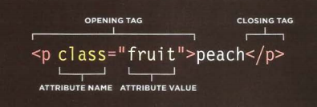

# Intro to Web Scraping

## What is web scraping?

 **Scraping** is extracting data - text or numbers - *from* the web *to* a file.

## Why might you need to scrape?

When you want:

* Information from a lot of similar pages
* Information structured in a way that you can use to analyze or make other things
* To harvest things such as:
  * Emails/contact info
  * Images
  * Downloading files/pdfs, etc.

for:

* Visualizations
  * Maps, charts, etc
* Dashboards
* Analysis
* Text processing

"Scraping" allows us to "scrape" information that we want from existing websites.  Some sites will have an existing way for you to get the information or data through file downloads or APIs. However, with other sites, we may not be so lucky. Web scraping empowers us to turn any web page into a source of data.

## What we will do today

1. Scrape for text manually
1. Scrape for emails using code
1. Scrape a table of data using code

Along the way, we will learn the steps of scraping, and how to scrape using the following tools:

* Chrome
  * Selector Gadget
* R
* RStudio

While our examples are in R, the same approach can be automated with most other languages such as Python or JavaScript.

## Scrape for text manually

To understand the steps of web scraping, let's start by thinking about how we might manually "scrape" or what we might do for one-off situations where we want data off a webpage.

The easiest approach would be to simply copy and paste the text directly from the page. How might we manually "scrape" one page for specific chunks of information?

Let's take ____ for example.

### What are the discrete steps?

1. Pick a page
1. Load the page
1. Look at the page
1. Decide what information we want
1. Select the location
1. Copy the information
1. Open a new plain text file
1. Paste the information
1. Save the file

For the use case of grabbing the current headlines for analysis, manually scraping the information is efficient.  However, if we were to want to grab the latest headlines each day, repeating these steps manually would become tedious and unmanageble.  At that point, automating the scraping with code would be more effective.

Another reason we would want to code to scrape is if we are grabbing multiple separate areas of text on a page, or if we want to grab the link addresses or image urls, etc.

## Scrape for emails using code

Let's scrape [http://www.houstontx.gov/departments.html](http://www.houstontx.gov/departments.html) for the emails of the heads of the departments.

Along with the steps from before, we will need to add one step, which is to find a way to tell the computer what information to select.

1. Pick a page
1. Load the page
1. Look at the page
1. Decide what information we want
1. **Determine a "selector" for where the information is**
1. Select the location
1. Copy the information
1. Open a new plain text file
1. Paste the information
1. Save the file

### Look at the page

Let's load the page in Chrome.  We can see that if we hover over the first person's link, the lower left hand of our browser displays an email link.  There's no easy way for us to manually get the email link address for each person by copying and pasting as before.

Getting a grasp of how the computer sees the page will help us tell it what part(s) to grab.  Let's "inspect" the page.

The code we see when we inspect the page is what the browser translates into the webpage.  For this webpage, this source code is what our scraper code will download from the Internet.

We can look at the HTML, or the code page content.  If we inspect the code specifically for the name of the first person by right clicking on it and choosing the "Inspect" option, we see the HTML for just that link highlighted.



We can see both the text of the link in between the `<a>` and `</a>` things. We also can see the address it links to by the `href=` thing.  Let's inspect the name of the second person by right clicking on it and choosing the "Inspect" option as before.  We see a similar pattern with the second person's name and email link.

The code for pretty much any link on a website will look similar.  The `<a>` and `</a>` things are the opening and closing tags.  The `href=` thing is called an attribute, where the attribute is named `href` and the value is the link address itself.  This unit of HTML, with the opening and closing tags, the attributes, and the content the tag encloses, is called an HTML element.

If we glance at the HTML around the HTML for the links, we will see a similar pattern of open and closing tags for content, along with different attributes for that content on the opening tags.

In addition to `a`/link elements, HTML has `table` elements, list elements, paragraph elements, heading elements of different importance, and many more.  So far, we've only mentioned how a website codes for it's content.

For it's appearance, such as the color of links, or the font to use for the paragraphs, websites use CSS.  CSS works with selections and appearance rules for those selections.  That is, it has selectors that match for specific elements or element, and then it declares how those things should be styled in between the curly brackets.

We can use these same selectors to communicate what selections need to be scraped.  There are other options for selectors, but CSS selectors are both powerful and flexible.

Now that we've looked at the page and understand its structure a bit, we can think about what information we're wanting to scrape, and selectors we need to scrape them.  The Inspector will help us, but we can also use the Selector Gadget plugin to help us further.

### Determine a "selector" for where the information is

Let's turn it on.  If we click on an element, what we clicked on will turn green.  However, the selector for that element can be used to select all elements that match.  Those additional matches are now in yellow.  We can click on elements we want to exclude of the yellow ones, and they will turn red once the selector box updates to exclude them.  You can click the `?` on the Selector Gadget at anytime for a reminder of how it works.

Notice how the text in the left box changes with our different clicks.  That informs us that the selector will select for green and yellow elements.  The `clear` button is very handy if you want to start over with making your selector.

To select for just the links per person, we click on the first person's link, and click on a yellow link in the top section to exclude links outside of the people boxes.  We get something like `.table150 a`.  Let's make a note of this selector.  

Try some other selections and look at the selectors as you update your selections.  You may notice some patterns.

Let's take some selectors and try them in R.

### Scraping information R

```
# Let's tell R to remember the url.
depts_url <- "http://www.houstontx.gov/departments.html"

link_addresses <- depts_url %>%
# First, we need to load the page.
  read_html() %>%
# Let's select an `html_node`
  html_node(".table150 a") %>%
# and look at the text.
  html_text()

# We can also grab the attribute `href` to get the link address as well!
link_addresses <- depts_url %>%
  read_html() %>%
  html_node(".table150 a") %>%
  html_attr("href")

# Switching `html_node` to `html_nodes` gets back all the matching link elements!
link_addresses <- depts_url %>%
  read_html() %>%
  html_nodes(".table150 a")

# So, we can get all the text values of the link elements
link_addresses <- depts_url %>%
  read_html() %>%
  html_nodes(".table150 a") %>%
  html_text()

# or, all the link address from the `href` attribute.
link_addresses <- depts_url %>%
  read_html() %>%
  html_nodes(".table150 a") %>%
  html_attr("href")

# To grab just the emails, we can either grab just the odd values from this list
odd_locations <- link_addresses %>%
  length() %>%
  seq(1, ., 2)

email_addresses <- link_addresses[odd_locations]

# or, we can adjust the CSS selector.
# one option for CSS selector
link_addresses <- depts_url %>%
  read_html() %>%
  html_nodes(".table150 a:nth-child(3) , .table150 a:nth-child(1)") %>%
  html_attr("href")

# another
link_addresses <- depts_url %>%
  read_html() %>%
  html_nodes(".table150 a:first-of-type") %>%
  html_attr("href")
```

Now, we can code the bolded steps:

1. Pick a page
1. **Load the page**
1. Look at the page
1. Decide what information we want
1. Determine a "selector" for where the information is
1. **Select the location**
1. **Copy the information**
1. **Open a new plain text file**
1. **Paste the information**
1. **Save the file**

```r
# Let's tell R to remember the url.
depts_url <- "http://www.houstontx.gov/departments.html"

link_addresses <- depts_url %>%
# Step 2, Load the page
  read_html() %>%
# Step 6, Select the location
  html_nodes(".table150 a") %>%
# Step 7, Copy the information
  html_attr("href")

# Step 8, Open a new plain text file 
fileConn <- file("output.txt")

# Step 9 & 10, Paste the information and save the file
writeLines(link_addresses, fileConn)

# Close the file
close(fileConn)
```

The small adjustment we made to the CSS selector shows how powerful selectors can be.  This [interactive tutorial](https://flukeout.github.io/) teaches us about CSS selectors and helps us get practice.


BONUS CHALLENGE: 
Try using what you've learned so far in R and rvest to scrape for `name`, `phone number`, `email`, `department`, and `website`. This requires a little bit of data cleaning. 

Here's one way of going about it: 
```r
library(rvest)
library(dplyr)
library(stringr)

# Save department url
depts_url <- "http://www.houstontx.gov/departments.html"

# Load page
depts_html <- depts_url %>%
  read_html()

# Extract names
name <- depts_html %>%
  html_nodes('.table150 a:nth-child(3) , .table150 a:nth-child(1)') %>%
  html_text() %>%
  gsub("\\n|\\s{2,}", " ", .) %>%
  trimws()

# Extract emails
email <- depts_html %>%
  html_nodes('.table150 a:nth-child(3) , .table150 a:nth-child(1)') %>%
  html_attr("href")

# Extract departments
dept <- depts_html %>%
  html_nodes('br~ br+ a') %>%
  html_text() %>%
  gsub("\\n|\\s{2,}", " ", .) %>%
  trimws()

# Extract websites
website <- depts_html %>%
  html_nodes('br~ br+ a') %>%
  html_attr("href")

# Extract phone number 
phone_number <- depts_url %>%
  read_html() %>%
  html_nodes(".table150 p") %>%
  html_text() %>%
  stringr::str_extract("[0-9]{3}\\.[0-9]{3}\\.[0-9]{4}") %>%
  unlist()

# Combine scraped data into a table
df <- data.frame(Names = name,
                 Phone = phone,
                 Email = email,
                 Dept = dept,
                 Website = website)
```


## Scrape Tables over Multiple Pages

We are now going to try an example that involves "web crawling" - a practice that requires "looping" through multiple web pages in an automated fashion instead of one page at a time. 

Let's take a look at some nba data. Go to this link:
http://www.espn.com/nba/attendance. 

This page presents a nice, detailed table on audience game attendance stats for different teams at different points in time. In fact, if you click on the drop down button next to "Season", you'll see that this includes data all the way back to 2001.

So what if we wanted to do some cool analysis on audience game attendance over time? True, we could scrape the contents a year at a time... But what if the data contained 50+ years of info??? 

Luckily, rvest gives us the tools to "crawl", or obtain data from several pages.

Let's first load the url of the website.

```espn_url <- "http://www.espn.com/nba/attendance"```

Next, lets create a variable called ```espn_data```. Similar like we did in the last example, we are going to pipe read_html() to the url. Since the html attribute we are interested in is "table", we will also assign that as an argument to html_node().

Since we want the data in a manageable format, we are going to also pipe ```html_table(header = TRUE)``` which will grab what we want and put it in a table, or more precisely, a dataframe.

```r
espn_html <- espn_year_url %>%
  read_html()

espn_year_data <- espn_html %>%
  html_node("table")
```

This is scraped data from only the year 2017. How do we go about scraping data from the other years?

If we go ahead and select different years from the drop down, the url we are presented with uses the template
"http://www.espn.com/nba/attendance/_/year/", with `year` being the only variable that changes from year to year. 

By looping through the years, we can modify and update the url so that we can scrape all the available years.

Let's assign that url template to a variable. We also want to capture the range of years that we want. We can do that with the ```seq()``` function.
```r
espn_years_base_url <- "http://www.espn.com/nba/attendance/_/year/"
years <- seq(2001, 2017)
```
Before we start looping through, lets create an empty dataframe. 
```espn_years_data <- data.frame()```

Now we are ready to build our loop function!
Our strategy is simple. We want to build out a script that performs the same actions used to create `espn_data`, except by updating and adding on new year data to the previous year. 

```r
for (year in years) {
  espn_year_url <- paste0(espn_years_base_url, year)
  espn_year_data <- espn_year_url %>%
    read_html() %>%
    html_node("table") %>%
    html_table()
  espn_years_data <- rbind(espn_years_data, espn_year_data)
}

espn_years_data
```

We keep track of all of the different years by binding the rows of the current table being processed to the existing data frame. When the loop ends, we are left with a pretty comprehensive data frame that we can clean up, and analyze later. 

Since we are not going to be analyzing the data right away, let's save our resulting dataframe as a csv.

```write.csv(espn_years_data, file = "espn_years_data.csv")```

Another way to grab the urls for each year is to scrape for the values in the dropdown options like so:

```
espn_year_urls <- espn_html  %>%
  html_node(".tablesm") %>%
  html_nodes("option") %>%
  html_attr("value")
```

Now, you can loop over each url in a similar manner:

```
espn_years_data <- data.frame()
for (espn_year_url in espn_year_urls) {
  espn_year_data <- espn_year_url %>%
    paste0("http:", .) %>%
    read_html() %>%
    html_node("table") %>%
    html_table()
  espn_years_data <- rbind(espn_years_data, espn_year_data)
}
```

Congrats on building your first web crawler using R! Looping through web pages is super powerful, and will allow you to analyze large amounts of interesting data floating out there on the web. 


### Next level stuff

### When these tools aren't enough

Let's try scraping [https://www.governmentjobs.com/careers/houston](https://www.governmentjobs.com/careers/houston). The page has a table-like structure like the previous page we looked at. Let's try scraping it with rvest by choosing a selector. 
```r
job_url <- "https://www.governmentjobs.com/careers/houston"
job_page <- job_url %>%
  read_html() %>%
  html_nodes(".table") %>%
  html_table()
```

The functions we used previously don't seem to be returning what we want.

To troubleshoot this, let's take a look at the page source.  Hmm... Doesn't look like the content is showing up in the view source.  If the content you are looking for is not in view source, it means that the information you want to scrape is being written into the HTML page using JavaScript, and we will need to scrape the content using a simulated browser. The simulated browwer will run the page as if it were actually loaded by a browser so that the JavaScript can run, and write the content that we want to grab.

Luckily, there is a tool we can use called Selenium. Selenium is a piece of software that is able to automate browsers. With it, we can simulate clicking buttons, filling in forms, pressing certain keys etc. R has a library called `RSelenium` that allows us to use Selenium functionality. 

Using the same rvest functions combined with the power of Selenium, we can now successfully scrape the page with this script.

```r
library(RSelenium)

# Save link for job description
job_url <- "https://www.governmentjobs.com/careers/houston"

# Start a chrome browser & selenium driver
rD <- rsDriver(port = 4444L,browser= "chrome")
rsDr <- rD$client

# Navigate to link in browser
rsDr$navigate(job_url)

# Read page source HTML
job_html <- rsDr$getPageSource() %>%
  .[[1]] %>%
  read_html()

# Extract table from HTML
dat <- job_html %>%
  html_nodes(".table") %>%
  html_table() %>%
  .[[1]]

# Close browser & selenium driver
rsDr$close()
rsDr$closeServer()
```

### rvest cheat sheet

| Name       | Description                                                                     |
|------------|---------------------------------------------------------------------------------|
| read_html  | Read an HTML document from a url, a file on disk or a string containing html    |
| html_nodes | Select nodes from an HTML document                                              |
| html_text  | Extract attributes, text and tag name from html.                                |
| html_table | Parse an html table into a data frame.                                          |
| html_attrs | Extract html attributes                                                         |

#### Finding help &  Extra Resources

##### Data Cleaning

Check out the [stringR](http://stringr.tidyverse.org/articles/stringr.html) package for easy text manipulation. 

In some of the examples we used regex (regular expressions) to extract patterns from the text. You can find a good regex primer [here](https://github.com/zeeshanu/learn-regex)

##### Tutorials
Review what you learned today and more with this rvest [Data Camp tutorial](https://www.datacamp.com/community/news/web-scraping-in-r-rvest-tutorial-43z6wf5u86)

Learn to scrape data in Python using [Beautiful Soup and Pandas](https://pythonprogramminglanguage.com/web-scraping-with-pandas-and-beautifulsoup/) 

##### Scraping Outside of R 

Advanced Web Crawling with [Scrapy](https://scrapy.org/)

Scraping PDF documents with [Tabula](http://tabula.technology/)
